# Manual da base de dados

**Banco:** MySQL, schema `rotaperfumes` (padrão do `Makefile`: `DB_NAME?=rotaperfumes`), charset `utf8mb4`, collation `utf8mb4_unicode_ci` (definidos no `make db-create`).
**Fonte da verdade:** os scripts em `sql/` (DDLs mais as migrações de alteração, em ordem numérica). Em caso de divergência entre este manual e um script, vale o script.
**Autor:** SubBrain (2026-09-25, card DOC-02; atualizado no Lote 5 com o NEG-02, CNPJ alfanumérico, no Lote 6 com a migração 21 e `refresh_tokens.revoked_reason`, no Lote 8 com a migração 22 e `usuarios.tokens_validos_desde` e, no Lote 11, 2026-09-26, card DOC-04, com o detalhamento de todas as tabelas; no Lote 12, 2026-09-27, com DB-01 (`estoque` no `db-up`), SEC-11 (credenciais do banco), SEC-12 (migração 23, `refresh_tokens.reuso_detectado_em`) e CHORE-02 (limpeza de `refresh_tokens`)).

> **Escopo:** todas as tabelas do schema atual, campo a campo, com PK, FKs, índices, relacionamentos, regras de negócio conhecidas e as migrações que afetam cada uma. Os itens que não estão claros nos arquivos estão marcados como **a confirmar** e reunidos na seção 22.

---

## Sumário

1. [Visão geral e convenções](#1-visão-geral-e-convenções)
2. [Índice das tabelas](#2-índice-das-tabelas)
3. [Diagrama de relacionamentos](#3-diagrama-de-relacionamentos)
4. [Resumo dos scripts e migrações](#4-resumo-dos-scripts-e-migrações)
5. Autenticação: [`vendedores`](#5-tabela-vendedores), [`usuarios`](#6-tabela-usuarios) (inclui a migração 22), [`refresh_tokens`](#7-tabela-refresh_tokens-e-migração-21-sec-07-lote-6-2026-09-26) (inclui a migração 21), [`senha_historico`](#8-tabela-senha_historico)
6. CRM: [`clientes`](#9-tabela-clientes), [`carteiras`](#10-tabela-carteiras), [`oportunidades`](#11-tabela-oportunidades), [`visitas`](#12-tabela-visitas)
7. ERP: [`produtos`](#13-tabela-produtos), [`pedidos`](#14-tabela-pedidos), [`itens_pedido`](#15-tabela-itens_pedido), [`pagamentos`](#16-tabela-pagamentos), [`estoque`](#17-tabela-estoque)
8. Migração 19 e backups: [migração 19](#18-migração-19-unificação-dos-cnpjs-duplicados), [tabelas de backup](#19-tabelas-de-backup-da-migração-19), [reversão](#20-reversão-make-db-revert-cnpj-unique), [consultas](#21-consultas-de-verificação-da-migração-19)
9. [Pontos a confirmar](#22-pontos-a-confirmar)
10. [Credenciais do banco e uso do `mysql` (SEC-11)](#23-credenciais-do-banco-e-uso-do-mysql-sec-11-lote-12-2026-09-27)

---

## 1. Visão geral e convenções

- **Engine:** InnoDB em todas as tabelas com `ENGINE` explícito. `senha_historico` não declara engine, charset nem collation: herda os padrões do servidor e do banco (a confirmar, seção 22).
- **Controle:** quase todas as tabelas têm `created_at` (`TIMESTAMP NOT NULL DEFAULT CURRENT_TIMESTAMP`) e `updated_at` (`TIMESTAMP NOT NULL DEFAULT CURRENT_TIMESTAMP ON UPDATE CURRENT_TIMESTAMP`). Nas tabelas abaixo eles aparecem numa linha só. Exceção: `senha_historico` tem só `created_at`, e ele aceita NULL.
- **`*_id_origem` promovido a PK (atualização de 2026-09-15):** em `clientes`, `pedidos`, `itens_pedido` e `carteiras`, o id do CSV de origem deixou de ser uma coluna auxiliar e virou a própria PK `BIGINT AUTO_INCREMENT`. A antiga PK interna `id` foi removida. `pagamentos`, `oportunidades` e `visitas` seguem o mesmo princípio, mas com o nome do CSV (`pagamento_id`, `oportunidade_id`, `visita_id`). Os importadores gravam o id explicitamente (upsert na PK). `vendedores`, `usuarios`, `produtos` e `estoque` têm PK `id` própria.
- **Colunas de FK para clientes:** `cliente_id` das tabelas filhas guarda o `clientes.cliente_id_origem`. Todas as FKs para `clientes` apontam para `cliente_id_origem`.
- **Booleanos:** `TINYINT(1)` com 0/1. No CSV vêm como S/N.
- **Valores monetários:** `DECIMAL(15,2)` (totais) ou `DECIMAL(10,2)` (preços unitários). Percentuais: `DECIMAL(5,2)` (ex.: 5.00 = 5%).
- **Exclusão lógica x física** (conferido nos repositórios em `apis/shared/repositories`):

| Tabela | Como é "excluída" |
| --- | --- |
| `vendedores` | Lógica: `data_desligamento` preenchida (`DELETE /api/vendedores/{id}`). Reativação limpa a data. |
| `usuarios` | Lógica: `ativo = 0` (`PATCH /api/usuarios/{id}/inativar`). Não há DELETE físico no repositório. |
| `clientes`, `produtos` | Lógica: `ativo = 0`. Não há DELETE físico no repositório. |
| `pedidos` (+ `itens_pedido`) | Física, numa transação (`DeleteComItens`). O handler/service bloqueia pedido com pagamento vinculado ou com status Faturado. |
| `pagamentos`, `carteiras`, `oportunidades`, `visitas` | Física. |
| `refresh_tokens` | Revogação (`revoked_at` + `revoked_reason`). Limpeza física periódica pela própria API desde o CHORE-02 (Lote 12): apaga tokens com `expires_at` anterior a agora menos `REFRESH_TOKEN_RETENCAO` (seção 7.2). |
| `estoque`, `senha_historico` | Não há DELETE no repositório. |

---

## 2. Índice das tabelas

A ordem é a do `make db-up`, que cria o schema vazio. O `make db-seed` roda o `db-up` e depois os seeds. O `make db-reset` apaga o banco e roda o `db-seed`. O `make db-rebuild` faz o `db-reset` e roda todos os importadores.

| Tabela | Script de criação | Migrações que alteram | Seção |
| --- | --- | --- | --- |
| `vendedores` | `sql/01_ddl_usuarios.sql` | - | 5 |
| `usuarios` | `sql/01_ddl_usuarios.sql` | 08 (`deve_trocar_senha`), 22 (`tokens_validos_desde`) | 6 |
| `refresh_tokens` | `sql/06_ddl_refresh_tokens.sql` | 21 (`revoked_reason`), 23 (`reuso_detectado_em`) | 7 |
| `senha_historico` | `sql/07_ddl_senha_historico.sql` | 13 (ENUM `tipo_reset`) | 8 |
| `clientes` | `sql/09_ddl_clientes.sql` | 19 (`uq_clientes_cnpj`), 20 (COMMENT de `cnpj`) | 9 |
| `produtos` | `sql/10_ddl_produtos.sql` | - | 13 |
| `pedidos` | `sql/04_ddl_pedidos.sql` | 19 (transferência de `cliente_id`, só dados) | 14 |
| `itens_pedido` | `sql/11_ddl_itens_pedido.sql` | - | 15 |
| `pagamentos` | `sql/12_ddl_pagamentos.sql` | - | 16 |
| `carteiras` | `sql/14_ddl_carteiras.sql` | 19 (transferência/descarte, só dados) | 10 |
| `oportunidades` | `sql/15_ddl_oportunidades.sql` | 19 (transferência, só dados) | 11 |
| `visitas` | `sql/16_ddl_visitas.sql` | 19 (transferência, só dados) | 12 |
| `estoque` | `sql/17_ddl_estoque.sql` (no `db-up` desde o DB-01, Lote 12, depois do 16) | 18 (remove `origem`; só bancos antigos) | 17 |
| `clientes_merge_backup_20260925` | criada pela migração 19 | - | 19 |
| `clientes_merge_backup_20260925_vinculos` | criada pela migração 19 | - | 19 |

---

## 3. Diagrama de relacionamentos

Só as colunas de chave. Entre parênteses, a regra `ON DELETE`. Todas as FKs usam `ON UPDATE CASCADE`, exceto as duas de `senha_historico`, que não declaram `ON UPDATE`.

```mermaid
erDiagram
    vendedores ||--o{ usuarios : "id_vendedor (SET NULL)"
    usuarios ||--o{ refresh_tokens : "usuario_id (CASCADE)"
    usuarios ||--o{ senha_historico : "usuario_id (CASCADE)"
    usuarios |o--o{ senha_historico : "resetado_por_id (SET NULL)"
    clientes ||--o{ pedidos : "cliente_id (RESTRICT)"
    vendedores ||--o{ pedidos : "vendedor_id (RESTRICT)"
    pedidos ||--o{ itens_pedido : "pedido_id (CASCADE)"
    produtos ||--o{ itens_pedido : "produto_id (RESTRICT)"
    pedidos ||--o{ pagamentos : "pedido_id (RESTRICT)"
    clientes ||--o{ carteiras : "cliente_id (CASCADE)"
    vendedores ||--o{ carteiras : "vendedor_id (RESTRICT)"
    clientes ||--o{ oportunidades : "cliente_id (CASCADE)"
    vendedores ||--o{ oportunidades : "vendedor_id (RESTRICT)"
    clientes ||--o{ visitas : "cliente_id (CASCADE)"
    vendedores ||--o{ visitas : "vendedor_id (RESTRICT)"
    produtos ||--o{ estoque : "sku (RESTRICT)"

    vendedores { BIGINT id PK }
    usuarios { BIGINT id PK
               VARCHAR email UK
               BIGINT id_vendedor FK }
    refresh_tokens { BIGINT id PK
                     BIGINT usuario_id FK
                     VARCHAR token_hash UK }
    senha_historico { BIGINT id PK
                      BIGINT usuario_id FK
                      BIGINT resetado_por_id FK }
    clientes { BIGINT cliente_id_origem PK
               CHAR cnpj UK }
    produtos { BIGINT id PK
               VARCHAR sku UK }
    pedidos { BIGINT pedido_id_origem PK
              BIGINT cliente_id FK
              BIGINT vendedor_id FK }
    itens_pedido { BIGINT item_id_origem PK
                   BIGINT pedido_id FK
                   BIGINT produto_id FK }
    pagamentos { BIGINT pagamento_id PK
                 BIGINT pedido_id FK }
    carteiras { BIGINT carteira_id_origem PK
                BIGINT cliente_id FK
                BIGINT vendedor_id FK }
    oportunidades { BIGINT oportunidade_id PK
                    BIGINT cliente_id FK
                    BIGINT vendedor_id FK }
    visitas { BIGINT visita_id PK
              BIGINT cliente_id FK
              BIGINT vendedor_id FK }
    estoque { BIGINT id PK
              VARCHAR sku FK }
```



As tabelas de backup da migração 19 (seção 19) não têm FK e ficam fora do diagrama.

**Efeito prático das regras:**
- Um cliente só pode ser apagado fisicamente se não tiver pedidos (`RESTRICT`). Se puder, leva junto carteiras, oportunidades e visitas (`CASCADE`). Na prática a API só inativa (`ativo = 0`).
- Um vendedor com pedidos, carteiras, oportunidades ou visitas não pode ser apagado fisicamente (`RESTRICT`). Os usuários vinculados ficariam com `id_vendedor = NULL`. Na prática a API só desliga (`data_desligamento`).
- Um pedido com pagamentos não pode ser apagado (`RESTRICT`). Os itens vão junto (`CASCADE`).
- Um produto com itens de pedido ou histórico de estoque não pode ser apagado (`RESTRICT`). A troca do `sku` propaga para `estoque` (`ON UPDATE CASCADE`).

---

## 4. Resumo dos scripts e migrações

"Reversível" indica se existe script de reversão em `sql/`.

| Nº | Arquivo | O que faz | Alvo do Makefile | Reversível? |
| --- | --- | --- | --- | --- |
| 01 | `01_ddl_usuarios.sql` | Cria `vendedores` e `usuarios` | `db-up` | Não (DDL base) |
| 02 | `02_seed_admin.sql` | Upsert do admin (id 1) com hash placeholder | `db-seed` | Não |
| 03 | `03_seed_vendedores.sql` | 42 vendedores (ids 1..42) e um usuário `normal` por vendedor, com hash placeholder | `db-seed` | Não |
| 04 | `04_ddl_pedidos.sql` | Cria `pedidos` | `db-up` | Não (DDL base) |
| 05 | `05_seed_pedidos.sql` | Descontinuado: só comentários, sem SQL | nenhum | - |
| 06 | `06_ddl_refresh_tokens.sql` | Cria `refresh_tokens` (já com `revoked_reason` e `reuso_detectado_em`) | `db-up` | Não (DDL base) |
| 07 | `07_ddl_senha_historico.sql` | Cria `senha_historico` (já com o ENUM corrigido) | `db-up` | Não (DDL base) |
| 08 | `08_alter_usuarios_deve_trocar_senha.sql` | Adiciona `usuarios.deve_trocar_senha` (idempotente) | `db-fix-deve-trocar-senha` | Não (sem script) |
| 09 | `09_ddl_clientes.sql` | Cria `clientes` (já com `uq_clientes_cnpj` e o COMMENT novo) | `db-up` | Não (DDL base) |
| 10 | `10_ddl_produtos.sql` | Cria `produtos` | `db-up` | Não (DDL base) |
| 11 | `11_ddl_itens_pedido.sql` | Cria `itens_pedido` | `db-up` | Não (DDL base) |
| 12 | `12_ddl_pagamentos.sql` | Cria `pagamentos` | `db-up` | Não (DDL base) |
| 13 | `13_alter_senha_historico_tipo_reset.sql` | Corrige o ENUM de `tipo_reset` | `db-fix-tipo-reset` | Não (sem script) |
| 14 | `14_ddl_carteiras.sql` | Cria `carteiras` | `db-up` | Não (DDL base) |
| 15 | `15_ddl_oportunidades.sql` | Cria `oportunidades` | `db-up` | Não (DDL base) |
| 16 | `16_ddl_visitas.sql` | Cria `visitas` | `db-up` | Não (DDL base) |
| 17 | `17_ddl_estoque.sql` | Cria `estoque` já no schema final, **sem** `origem` (DB-01) | `db-up` (último passo, depois do 16) | Não (DDL base) |
| 18 | `18_alter_estoque_drop_origem.sql` | Remove `estoque.origem` em bancos criados com o 17 antigo (idempotente desde o DB-01) | `db-fix-estoque-origem` | Sim: `18_revert_...`, `db-revert-estoque-origem` (recria `origem`, mas todas as linhas voltam como `import_csv`) |
| 19 | `19_alter_clientes_cnpj_unique.sql` | Unifica CNPJs duplicados e cria `uq_clientes_cnpj` | `db-fix-cnpj-unique` | Sim: `19_revert_...`, `db-revert-cnpj-unique` |
| 20 | `20_alter_clientes_cnpj_comment.sql` | Troca o COMMENT de `clientes.cnpj` | `db-fix-cnpj-comment` | Sim: `20_revert_...`, `db-revert-cnpj-comment` |
| 21 | `21_alter_refresh_tokens_revoked_reason.sql` | Adiciona `refresh_tokens.revoked_reason` (idempotente) | `db-fix-revoked-reason` | Sim: `21_revert_...`, `db-revert-revoked-reason` (perde os motivos) |
| 22 | `22_alter_usuarios_tokens_validos_desde.sql` | Adiciona `usuarios.tokens_validos_desde` (idempotente) | `db-fix-tokens-validos-desde` | Sim: `22_revert_...`, `db-revert-tokens-validos-desde` (perde os cortes) |
| 23 | `23_alter_refresh_tokens_reuso_detectado_em.sql` | Adiciona `refresh_tokens.reuso_detectado_em` (SEC-12, idempotente) | `db-fix-reuso-detectado` | Sim: `23_revert_...`, `db-revert-reuso-detectado` (perde as marcas de reuso) |

- As migrações de alteração (08, 13, 18 a 23) **não** fazem parte do `db-up`/`db-seed`/`db-reset`. Servem para bancos criados antes da mudança. Desde o DB-01 (Lote 12), **todos** os DDLs base nascem com o resultado delas, inclusive o 17 (sem `estoque.origem`).
- Todos os alvos que chamam o `mysql` (`db-create`, `db-down`, `db-fix-*`, `db-revert-*`; `db-up`/`db-seed`/`db-reset` herdam via `db-create`) dependem de `db-check-env` e exigem `DB_USUARIO`/`DB_SENHA` no `.env` (SEC-11, seção 23). Os cabeçalhos dos scripts ensinam a execução manual com `MYSQL_PWD="$DB_SENHA" mysql --local-infile=1 -u $DB_USUARIO -h ...`, sem `-p` no argv.
- Depois do `db-seed`, o Makefile roda `resetpassword -list`, `-create-admin` e `-all-users` (`apis/shared`), que trocam os hashes placeholder dos seeds 02 e 03 por bcrypt real.
- Importadores (`db-import-*`, `apis/shared/cmd/import*`): upsert idempotente a partir de `dados/crm/*.csv` e `dados/erp/*.csv`. Ordem de dependência: clientes e produtos, depois pedidos (e itens), pagamentos, carteiras, oportunidades, visitas e estoque.

---

## 5. Tabela `vendedores`

Vendedores do CRM. Criada em `01_ddl_usuarios.sql` para servir de destino à FK de `usuarios`. Populada pelo seed `03_seed_vendedores.sql` com 42 vendedores e ids explícitos 1..42. Os CSVs de pedidos, carteiras, oportunidades e visitas usam esses mesmos ids, sem lookup.

| Campo | Tipo | Nulo | Default | Descrição |
| --- | --- | --- | --- | --- |
| `id` | BIGINT AUTO_INCREMENT | não | - | PK. |
| `nome` | VARCHAR(120) | não | - | Nome completo. |
| `regiao` | VARCHAR(80) | não | - | Região de atuação (ex.: Curitiba). |
| `uf` | CHAR(2) | não | - | UF. |
| `data_admissao` | DATE | não | - | Data de admissão. |
| `data_desligamento` | DATE | sim | NULL | **NULL = vendedor ativo.** Preenchida = desligado. |
| `meta_mensal` | DECIMAL(15,2) | não | 0.00 | Meta mensal em R$. |
| `created_at`, `updated_at` | TIMESTAMP | não | CURRENT_TIMESTAMP | Controle. |

**Índices:** só `PRIMARY` (`id`). Não há UNIQUE de nome.

**Relacionamentos:** referenciada por `usuarios.id_vendedor` (SET NULL), e por `pedidos`, `carteiras`, `oportunidades` e `visitas` via `vendedor_id` (RESTRICT).

**Regras de negócio:**
- **Exclusão lógica:** `DELETE /api/vendedores/{id}` grava `data_desligamento` com `COALESCE` (desligar de novo mantém a data original). Na mesma transação, inativa os usuários vinculados, grava o corte `tokens_validos_desde` e revoga os refresh tokens deles com motivo `inativacao` (SEC-06, SEC-08). A reativação limpa a data (`SetDataDesligamento` com NULL) e não grava corte. Se ela também reativa os usuários vinculados está a confirmar.
- O seed 03 usa `INSERT IGNORE`: rodar de novo não altera vendedores existentes.

**Migrações:** nenhuma alteração de schema.

---

## 6. Tabela `usuarios`

Usuários de login do sistema, com papel (`admin`/`normal`) e vínculo opcional a um vendedor.

| Campo | Tipo | Nulo | Default | Descrição |
| --- | --- | --- | --- | --- |
| `id` | BIGINT AUTO_INCREMENT | não | - | PK. É o `sub` do JWT. O admin principal do seed é o id 1. |
| `nome` | VARCHAR(120) | não | - | Nome completo. |
| `email` | VARCHAR(120) | não | - | E-mail de login. **Único** (`uk_usuarios_email`). A API grava em minúsculas e sem espaços nas pontas. |
| `password_hash` | VARCHAR(255) | não | - | Hash bcrypt (cost 12). Os seeds gravam um placeholder que o `resetpassword` troca. |
| `role` | ENUM('admin','normal') | não | 'normal' | Papel. `admin` acessa as rotas de administração. |
| `id_vendedor` | BIGINT | sim | NULL | FK `fk_usuarios_vendedor` → `vendedores.id` (`ON DELETE SET NULL`, `ON UPDATE CASCADE`). Define o escopo de dados do usuário `normal`. |
| `ativo` | TINYINT(1) | não | 1 | 1 = ativo, 0 = inativo (exclusão lógica). |
| `deve_trocar_senha` | TINYINT(1) | não | 0 | 1 = deve trocar a senha no próximo login (senha gerada pelo sistema). Migração 08. |
| `tokens_validos_desde` | DATETIME | sim | NULL | Corte de sessão. Migração 22, seção 6.1. |
| `created_at`, `updated_at` | TIMESTAMP | não | CURRENT_TIMESTAMP | Controle. |
| `ultimo_login_at` | TIMESTAMP | sim | NULL | Data do último login. |

**Índices:** `PRIMARY` (`id`), `uk_usuarios_email` (UNIQUE, `email`), `idx_usuarios_role`, `idx_usuarios_ativo`, `idx_usuarios_id_vendedor`.

**Relacionamentos:** N:1 opcional com `vendedores`. 1:N com `refresh_tokens` (CASCADE) e com `senha_historico` (`usuario_id` CASCADE, `resetado_por_id` SET NULL).

**Regras de negócio:**
- **`deve_trocar_senha`:** vai para 1 quando a senha é gerada pelo sistema: criação de usuário pelo admin (senha aleatória enviada por e-mail) e reset pelo admin (`AdminResetPassword`). Volta a 0 na troca feita pelo próprio usuário e no `ResetSenha` interno. O valor gravado pelo CLI `resetpassword` nos seeds está a confirmar.
- **Exclusão lógica:** inativação (`ativo = 0`) grava o corte `tokens_validos_desde` e revoga os refresh tokens com motivo `inativacao`. O desligamento do vendedor inativa os usuários vinculados (seção 5).
- **Seeds:** `02_seed_admin.sql` faz upsert do admin (id 1, `admin@rotaperfumes.com.br`). `03_seed_vendedores.sql` cria um usuário `normal` por vendedor (`nome.sobrenome@rotaperfumes.com.br`; homônimos recebem o sufixo da UF).

**Migrações:** 08 (`deve_trocar_senha`, depois de `ativo`, sem reversão) e 22 (`tokens_validos_desde`, seção 6.1).

### 6.1 Coluna `usuarios.tokens_validos_desde` e migração 22 (SEC-08, Lote 8, 2026-09-26)

Corte de sessão por usuário. Revogar refresh tokens não invalida os access tokens (JWT de 24h) já emitidos; esta coluna faz o middleware recusá-los.

| Campo | Tipo | Nulo | Descrição |
| --- | --- | --- | --- |
| `tokens_validos_desde` | DATETIME | sim | **Novo (migração 22)**, logo depois de `deve_trocar_senha`. `NULL` = sem corte (vale só assinatura e `exp`). Com valor: access token com `iat <= tokens_validos_desde`, ou sem `iat`, recebe `401` `"sessão encerrada — faça login novamente"`. COMMENT: "Access tokens com iat <= este instante são rejeitados (SEC-08); NULL = sem corte". |

**Índice:** nenhum. A coluna é lida junto com `ativo` e `role`, depois de achar o usuário pela PK (`sub` do JWT).

#### Quando o corte é gravado

O valor vem do Go (`time.Now().Truncate(time.Second)`), nunca do `NOW()` do MySQL (o DSN usa `loc=Local`, fuso fixo `-03:00`).

| Evento | Onde no código |
| --- | --- |
| Inativação do usuário (`PATCH /api/usuarios/{id}/inativar`) | `UsuarioRepository.SetAtivo(false)` |
| Desligamento do vendedor (`DELETE /api/vendedores/{id}`), para os usuários vinculados | `UsuarioRepository.InativarByVendedorID` |
| Troca de senha pelo usuário, reset pelo admin e `ResetSenha` | `UsuarioRepository.UpdatePasswordHash` |
| Reuso de refresh token rotacionado fora da janela (SEC-07), depois do `RevokeAllUserTokens`. Desde o SEC-12 (Lote 12), só no primeiro reuso do mesmo token dentro da janela de supressão (seção 7.1) | `UsuarioRepository.InvalidarSessoes`, chamado em `tratarTokenRevogadoForaDaJanela` (`auth_handler.go`) |
| CLI `resetpassword` | `UpsertAdmin`, `UpsertByEmail` (`apis/shared/tools/resetpassword`) |

**Não gravam corte:** reativação do usuário ou do vendedor e logout. Um login feito no mesmo segundo de um corte gera token recusado (regra `iat <= corte`; aceito pelo MegaBrain).

#### Migração 22

**Script:** `sql/22_alter_usuarios_tokens_validos_desde.sql`
**Comando:** `make db-fix-tokens-validos-desde`
**Reversão:** `make db-revert-tokens-validos-desde` (`sql/22_revert_usuarios_tokens_validos_desde.sql`; remove a coluna e perde os cortes gravados)
**Situação:** aplicada no banco local em 2026-09-26.

- Não altera nenhuma linha: os usuários existentes ficam `NULL` (sem corte).
- **Idempotente:** consulta `information_schema.COLUMNS` e só roda o `ALTER TABLE` se a coluna ainda não existir. O revert também é idempotente.
- Como a 19, a 20 e a 21, não faz parte do `db-up`/`db-seed`/`db-reset`. Bancos novos já recebem a coluna pelo `sql/01_ddl_usuarios.sql` (atualizado no mesmo card).

#### Consultas de verificação

```sql
SHOW FULL COLUMNS FROM usuarios LIKE 'tokens_validos_desde';
-- Type = datetime, Null = YES, Default = NULL

SELECT id, email, ativo, tokens_validos_desde
  FROM usuarios
 WHERE tokens_validos_desde IS NOT NULL
 ORDER BY tokens_validos_desde DESC;
-- só usuários que tiveram inativação, troca/reset de senha ou revogação em massa depois da migração
```

Referências: card SEC-08 em `tarefas/feito.md` (Lote 8); roteiro `docs/roteiro-teste-manual-lote8.md`, seção 1.

---

## 7. Tabela `refresh_tokens` e migração 21 (SEC-07, Lote 6, 2026-09-26)

Guarda os refresh tokens (hash SHA-256) emitidos no login e no refresh. Cada refresh é de uso único: o token antigo é revogado e um novo é gravado na mesma transação.

| Campo | Tipo | Nulo | Descrição |
| --- | --- | --- | --- |
| `id` | BIGINT AUTO_INCREMENT | não | PK. É o `token_id` dos logs de `[auth]`. |
| `usuario_id` | BIGINT | não | FK `fk_refresh_token_usuario` → `usuarios.id` (`ON DELETE CASCADE`, `ON UPDATE CASCADE`). |
| `token_hash` | VARCHAR(255) | não | SHA-256 do refresh token. **Único** (`uk_refresh_token_hash`). O token em texto puro nunca é gravado. |
| `expires_at` | DATETIME | não | Expiração. |
| `revoked_at` | DATETIME | sim | Data/hora da revogação. `NULL` = ativo. |
| `revoked_reason` | ENUM('rotacao','logout','revogacao_massa','senha','inativacao') | sim | **Novo (migração 21).** Motivo da revogação, gravado junto com `revoked_at`. `NULL` = token ativo ou revogado antes da migração (legado). |
| `reuso_detectado_em` | DATETIME | sim | **Novo (migração 23, SEC-12, Lote 12).** Instante do último reuso deste token já rotacionado que gerou corte de sessões. `NULL` = nunca. COMMENT: "Último reuso detectado deste token já rotacionado (SEC-12); NULL = nunca". Seção 7.1. |
| `ip_origem` | VARCHAR(45) | sim | IP que pediu o token (IPv4/IPv6). |
| `user_agent` | TEXT | sim | User-Agent no momento da criação. |
| `created_at`, `updated_at` | TIMESTAMP | não | Controle. |

**Índices:** `PRIMARY` (`id`), `uk_refresh_token_hash` (UNIQUE, `token_hash`), `idx_refresh_usuario_id`, `idx_refresh_expires_at` e `idx_refresh_revoked_at`. A migração 21 **não** cria índice para `revoked_reason`: as buscas são por `token_hash` e `usuario_id`, e o motivo só é lido depois de achar a linha. A migração 23 também não cria índice: `reuso_detectado_em` só é gravado por UPDATE pela PK.

**Limpeza:** periódica, feita pela própria API desde o CHORE-02 (Lote 12). Detalhes na seção 7.2.

### Valores de `revoked_reason`

| Valor | Quando é gravado | Onde no código |
| --- | --- | --- |
| `rotacao` | `POST /api/auth/refresh`: o token antigo é trocado por um novo. | `RefreshTokenService.BeginRotation` |
| `logout` | `POST /api/auth/logout`. | `auth_handler.go` (Logout) |
| `revogacao_massa` | Reuso, fora da janela de 30 s, de um token com motivo `rotacao` (possível roubo): todos os tokens ativos do usuário são revogados. | `auth_handler.go` (`tratarTokenRevogadoForaDaJanela`) |
| `senha` | Troca de senha pelo usuário (`POST /api/auth/reset-password`) ou reset pelo admin (`POST /api/admin/reset-password`). | `auth_handler.go`, `usuario_handler.go` |
| `inativacao` | Inativação do usuário (`PATCH /api/usuarios/{id}/inativar`) ou desligamento do vendedor dele (`DELETE /api/vendedores/{id}`, na mesma transação, via `RevokeAllByVendedorID`). SEC-06. | `usuario_handler.go`, `vendedor_service.go` |

**Regra de uso (SEC-07, opção B):** só o reuso de um token com motivo `rotacao` fora da janela de graça gera o alerta `[auth][seguranca]` e a revogação em massa. Os demais motivos e o `NULL` legado geram só log informativo. A resposta HTTP é sempre `401` `"refresh token revogado"`.

### Migração 21

**Script:** `sql/21_alter_refresh_tokens_revoked_reason.sql`
**Comando:** `make db-fix-revoked-reason`
**Reversão:** `make db-revert-revoked-reason` (`sql/21_revert_refresh_tokens_revoked_reason.sql`; remove a coluna e perde os motivos gravados)
**Situação:** aplicada no banco local em 2026-09-26 (107 tokens na tabela; os já revogados antes da migração ficaram com `NULL`).

- Adiciona `revoked_reason` logo depois de `revoked_at`, com `DEFAULT NULL` e COMMENT "Motivo da revogação (NULL = ativo ou revogado antes do SEC-07/legado)".
- Não altera nenhuma linha: os tokens legados ficam `NULL` de propósito, porque não há como saber o motivo real.
- **Idempotente:** consulta `information_schema.COLUMNS` e só roda o `ALTER TABLE` se a coluna ainda não existir. O revert também é idempotente.
- Como a 19 e a 20, não faz parte do `db-up`/`db-seed`/`db-reset`. Bancos novos já recebem a coluna pelo `sql/06_ddl_refresh_tokens.sql` (atualizado no mesmo card).

### Consultas de verificação

```sql
SHOW FULL COLUMNS FROM refresh_tokens LIKE 'revoked_reason';
-- Type = enum('rotacao','logout','revogacao_massa','senha','inativacao'), Null = YES, Default = NULL

SELECT revoked_reason, COUNT(*) AS tokens,
       SUM(revoked_at IS NULL) AS ativos
  FROM refresh_tokens
 GROUP BY revoked_reason;
-- ativos só aparecem na linha revoked_reason = NULL

SELECT COUNT(*) FROM refresh_tokens
 WHERE revoked_at IS NULL AND revoked_reason IS NOT NULL;   -- 0 (ativo nunca tem motivo)
```

Referências: cards SEC-06 e SEC-07 em `tarefas/feito.md` (Lote 6); roteiro `docs/roteiro-teste-manual-lote6.md`, seção 5.

### 7.1 Coluna `reuso_detectado_em` e migração 23 (SEC-12, Lote 12, 2026-09-27)

**Problema:** o token reusado continua com `revoked_reason = 'rotacao'`. Antes do SEC-12, cada novo envio dele (replay) repetia a revogação em massa e o corte `tokens_validos_desde`, derrubando a vítima de novo mesmo depois do re-login.

**Regra:** a supressão é **por token** (`id`), nunca por usuário. Assim, um atacante com **outro** refresh roubado continua sendo detectado depois do re-login da vítima.

- No reuso de um token `rotacao` fora da janela de graça de 30 s, o backend roda um UPDATE condicional atômico pela PK:
  `UPDATE refresh_tokens SET reuso_detectado_em = ? WHERE id = ? AND revoked_reason = 'rotacao' AND (reuso_detectado_em IS NULL OR reuso_detectado_em <= ?)`, com `agora` e `limite = agora - janela` vindos do relógio do Go (truncados no segundo), nunca do `NOW()` do MySQL.
- 1 linha afetada → corta as sessões (`RevokeAllUserTokens` com `revogacao_massa`, `InvalidarSessoes`) e envia o alerta do SEC-09. 0 linha → reuso repetido dentro da janela: **não** corta de novo e não envia e-mail; log `[auth][seguranca] refresh: reuso repetido de token rotacionado dentro da janela de supressão — sessões NÃO revogadas de novo`.
- Depois da janela, o próximo reuso do mesmo token volta a cortar.
- **Fail-closed:** erro ao gravar a marca → corta assim mesmo. Se o corte falhar (`RevokeAllUserTokens` ou `InvalidarSessoes`), a marca é desfeita (`UPDATE ... SET reuso_detectado_em = NULL WHERE id = ? AND reuso_detectado_em = ?`), para o próximo reuso tentar de novo.
- **Janela:** `REFRESH_REUSE_SUPPRESS_WINDOW`, padrão `30m`, faixa `1m` a `24h`. Valor inválido ou fora da faixa → a API não sobe.
- **Resposta HTTP:** idêntica nos dois casos (`401` `"refresh token revogado"`, sem `Set-Cookie`); o reuso continua contando no rate limit.

**Script:** `sql/23_alter_refresh_tokens_reuso_detectado_em.sql`
**Comando:** `make db-fix-reuso-detectado`
**Reversão:** `make db-revert-reuso-detectado` (`sql/23_revert_refresh_tokens_reuso_detectado_em.sql`; remove a coluna e perde as marcas gravadas. Volte antes o backend para uma versão que não usa a coluna, senão o refresh com reuso falha.)
**Situação:** aplicada no banco local (dev) em 2026-09-27.

- Adiciona a coluna logo depois de `revoked_reason`, `DATETIME NULL DEFAULT NULL`. Não altera nenhuma linha: as existentes ficam `NULL`.
- **Idempotente:** consulta `information_schema.COLUMNS` e usa `PREPARE`; o revert também é idempotente.
- Não faz parte do `db-up`/`db-seed`/`db-reset`. Bancos novos recebem a coluna pelo `sql/06_ddl_refresh_tokens.sql`.

```sql
SHOW FULL COLUMNS FROM refresh_tokens LIKE 'reuso_detectado_em';
-- Type = datetime, Null = YES, Default = NULL

SELECT id, usuario_id, revoked_reason, revoked_at, reuso_detectado_em
  FROM refresh_tokens
 WHERE reuso_detectado_em IS NOT NULL
 ORDER BY reuso_detectado_em DESC;
-- só tokens com revoked_reason = 'rotacao' que foram reusados
```

### 7.2 Limpeza periódica (CHORE-02, Lote 12, 2026-09-27)

- **Quem roda:** a própria API (`services.IniciarLimpezaRefreshTokens`, chamado no `cmd/server/main.go` depois do `db ping OK`). Roda uma vez na partida e depois a cada `REFRESH_CLEANUP_INTERVAL`. Cada execução tem timeout de 2 min; um panic é recuperado e logado sem derrubar a API. No shutdown, a API cancela a limpeza e espera até 10 s antes de fechar a conexão.
- **O que apaga:** `DELETE FROM refresh_tokens WHERE expires_at < ? ORDER BY id LIMIT ?`, com `corte = agora - REFRESH_TOKEN_RETENCAO` (relógio do Go) e lotes de **1000** linhas, repetidos até um lote vir incompleto ou o contexto ser cancelado. Usa o índice `idx_refresh_expires_at`. A regra é a mesma para revogados e não revogados.
- **Invariante:** nenhuma linha com `expires_at >= agora` é apagada. Depois de `expires_at` o token já não passa na validação (a expiração é checada antes da revogação), então não há mais detecção de reuso a preservar.
- **Configuração:**

| Variável | Padrão | Faixa | Observação |
| --- | --- | --- | --- |
| `REFRESH_TOKEN_RETENCAO` | `720h` (30 dias após `expires_at`) | `24h` a `8760h` | Fora da faixa → a API não sobe. O serviço nunca usa menos de 24h. |
| `REFRESH_CLEANUP_INTERVAL` | `6h` | `0` ou `>= 1m` | `0` desativa (log `limpeza periódica desativada`). `30s` → a API não sobe. |

- **Logs:** `[refresh] cleanup: limpeza periódica iniciada (intervalo=6h0m0s)`, `[refresh] cleanup: N tokens removidos (corte=...)`, `[refresh] cleanup: limpeza periódica encerrada` (shutdown) e `[server] tarefas de fundo encerradas`.
- **Sem alvo no Makefile:** um DELETE via `mysql` usaria o `NOW()` do servidor e duplicaria a regra. Um `cmd/cleanuprefresh` em Go fica como opção futura (seção 23.4).

---

## 8. Tabela `senha_historico`

Auditoria das trocas de senha. Cada linha guarda o hash **anterior** e quem fez a troca. A API usa esses dados para a tela de histórico (admin).

| Campo | Tipo | Nulo | Default | Descrição |
| --- | --- | --- | --- | --- |
| `id` | BIGINT AUTO_INCREMENT | não | - | PK. |
| `usuario_id` | BIGINT | não | - | Usuário cuja senha mudou. FK → `usuarios.id` (`ON DELETE CASCADE`). |
| `resetado_por_id` | BIGINT | sim | NULL | Admin que fez o reset. `NULL` quando o próprio usuário trocou ou quando o admin foi apagado. FK → `usuarios.id` (`ON DELETE SET NULL`). |
| `senha_hash_anterior` | VARCHAR(255) | não | - | Hash bcrypt da senha substituída. |
| `ip_origem` | VARCHAR(45) | **sim** | NULL | IP de quem fez a troca. |
| `user_agent` | TEXT | **sim** | NULL | User-Agent de quem fez a troca. |
| `tipo_reset` | ENUM('usuario','admin','primeiro_acesso','esquecimento') | não | - | Tipo da troca (ver abaixo). |
| `created_at` | TIMESTAMP | **sim** | CURRENT_TIMESTAMP | Data da troca. Não tem `NOT NULL` nem `updated_at`. |

**Índices:** `PRIMARY` (`id`), `idx_usuario` (`usuario_id`), `idx_data` (`created_at`).

**FKs:** as duas FKs foram declaradas sem nome, então o MySQL gera os nomes (normalmente `senha_historico_ibfk_1` e `_ibfk_2`; a confirmar no banco). Nenhuma declara `ON UPDATE`: vale o padrão do MySQL (`RESTRICT`/`NO ACTION`).

**Valores de `tipo_reset`** (`apis/rotaperfumes-api/services/senha_historico_service.go`):

| Valor | Significado | Gravado hoje? |
| --- | --- | --- |
| `usuario` | O usuário trocou a própria senha (`POST /api/auth/reset-password`). | Sim (`auth_handler.go`) |
| `admin` | Um admin resetou a senha (`POST /api/admin/reset-password`); `resetado_por_id` = admin. | Sim (`usuario_handler.go`) |
| `primeiro_acesso` | Troca no primeiro acesso. | Constante definida, sem uso fora dos testes (a confirmar) |
| `esquecimento` | Recuperação por esquecimento. | Constante definida, sem uso fora dos testes (a confirmar) |

**Regras de negócio e histórico:**
- **Colunas anuláveis (BUG-12, Lote 10):** `ip_origem`, `user_agent` e `created_at` aceitam NULL. Um registro com NULL derrubava a listagem com `500`. Desde o BUG-12 o repositório lê essas colunas como `sql.Null*`: NULL sai como `""` (texto) ou data zero `"0001-01-01T00:00:00Z"` (`created_at`), e a tela mostra `-`. O contrato JSON não mudou e não houve migração.
- **ENUM corrigido (migração 13):** o DDL original tinha `ENUM('proprio','admin','primeiro_login')`, mas o código grava `usuario`/`admin`/`primeiro_acesso`/`esquecimento`. Isso causava o erro 1265 e travava a troca de senha obrigatória. O `07_ddl_senha_historico.sql` já foi corrigido; bancos antigos recebem a correção por `make db-fix-tipo-reset`. Não há script de reversão.

**Migrações:** 13.

---

## 9. Tabela `clientes`

Base de clientes do CRM, importada de `dados/crm/clientes.csv` (`make db-import-clientes`).

| Campo | Tipo | Nulo | Descrição |
| --- | --- | --- | --- |
| `cliente_id_origem` | BIGINT AUTO_INCREMENT | não | PK. Corresponde 1:1 ao `cliente_id` do CSV. |
| `cnpj` | CHAR(14) | não | CNPJ sem máscara, em maiúsculas, numérico ou alfanumérico (NEG-02; formato na seção "CNPJ alfanumérico" abaixo). **Único** (`uq_clientes_cnpj`). |
| `razao_social` | VARCHAR(255) | não | Razão social. |
| `segmento` | VARCHAR(80) | não | Segmento de atuação (ex.: Perfumaria, E-commerce). |
| `cidade` | VARCHAR(120) | não | Cidade. |
| `uf` | CHAR(2) | não | UF. |
| `bairro` | VARCHAR(120) | sim | Bairro. |
| `data_cadastro` | DATE | não | Data de cadastro no CRM de origem. O CSV mistura `YYYY-MM-DD` e `DD/MM/YYYY`; o importador normaliza. |
| `ativo` | TINYINT(1) | não | 1 = ativo (padrão), 0 = inativo. No CSV vem como S/N. |
| `created_at` | TIMESTAMP | não | Criação do registro. |
| `updated_at` | TIMESTAMP | não | Última atualização (`ON UPDATE CURRENT_TIMESTAMP`). |

**Relacionamentos:** 1:N com `pedidos` (`fk_pedidos_cliente`, RESTRICT), `carteiras` (`fk_carteiras_cliente`, CASCADE), `oportunidades` (`fk_oportunidades_cliente`, CASCADE) e `visitas` (`fk_visitas_cliente`, CASCADE). Todas com `ON UPDATE CASCADE`.

**Exclusão:** lógica (`ativo = 0`). O repositório não tem DELETE físico.

**Migrações:** 19 (unificação e `uq_clientes_cnpj`, seção 18) e 20 (COMMENT de `cnpj`).

### Índices

| Índice | Tipo | Colunas |
| --- | --- | --- |
| `PRIMARY` | PK | `cliente_id_origem` |
| `uq_clientes_cnpj` | **UNIQUE** | `cnpj` |
| `idx_clientes_uf` | simples | `uf` |
| `idx_clientes_segmento` | simples | `segmento` |
| `idx_clientes_ativo` | simples | `ativo` |
| `idx_clientes_razao_social` | simples | `razao_social` |

### Índice único `uq_clientes_cnpj` (NEG-01, 2026-09-25)

- Substitui o antigo índice simples `idx_clientes_cnpj`, que não impedia CNPJ repetido. Depois da migração, o `idx_clientes_cnpj` não existe mais.
- Decisão do usuário (NEG-01): bloquear CNPJ duplicado no banco.
- Em bancos novos, o `sql/09_ddl_clientes.sql` já cria a tabela com o `uq_clientes_cnpj`. Em bancos que já existiam, quem cria o índice é a migração 19 (seção 18).
- Um INSERT/UPDATE com CNPJ repetido falha com o erro MySQL **1062** (`ER_DUP_ENTRY`). A API converte esse erro em `409` genérico "cnpj já cadastrado", sem revelar o vendedor dono do cliente. Um CNPJ com formato ou DV inválido é recusado antes, com `400` "cnpj inválido" (NEG-03 e NEG-04), então a checagem de duplicidade só se aplica a CNPJ válido.
- **Importação:** como o CSV tem CNPJs repetidos, os importadores unificam os duplicados antes de gravar (`apis/shared/importers/clientesdedup`; até o Lote 6 ficava em `cmd/internal/clientesdedup`). Fica a primeira ocorrência de cada CNPJ, que é o menor `cliente_id`, igual à regra da migração. O `importclientes` não grava as cópias, e os importadores de carteiras, pedidos, oportunidades e visitas redirecionam o `cliente_id` da cópia para o sobrevivente. Sem isso, a importação falharia com 1062.
- **Collation:** `cnpj` herda `utf8mb4_unicode_ci`, que ignora maiúsculas e minúsculas. No índice único, valores que só diferem na caixa colidem. O Backend grava em maiúsculas. Detalhes no cabeçalho de `sql/09_ddl_clientes.sql` (nota do NEG-02, CNPJ alfanumérico).

### CNPJ alfanumérico (NEG-02, 2026-09-25)

A coluna `cnpj` aceita o CNPJ alfanumérico da Receita Federal (vigente desde julho de 2026). **Não houve migração:** `CHAR(14)` com `utf8mb4_unicode_ci` já comporta letras, e não há CHECK, trigger nem view sobre a coluna.

- **Formato gravado:** 14 caracteres, sem máscara e em **maiúsculas**. As 12 primeiras posições são `[0-9A-Z]` e as 2 últimas (dígitos verificadores) são `[0-9]`. Ex.: `12ABC34501DE35` (exibido como `12.ABC.345/01DE-35`). Os CNPJs numéricos continuam válidos, e os 3000 clientes atuais são todos numéricos.
- **Dígito verificador:** módulo 11 com os pesos do CNPJ numérico. Cada caractere vale o código ASCII − 48 (`0`–`9` → 0–9, `A` → 17, …, `Z` → 42). O DV é validado pela API e pelo frontend, **não pelo banco**.
- **Regra central:** `apis/shared/cnpj` (`Normalizar`, `FormatoValido`, `Valido`, `DigitosVerificadores`), usada pela API (`services/cnpj.go`) e pelos importadores. O frontend espelha a regra em `frontend/src/lib/cnpj.ts`.
- **Caixa:** a API normaliza para maiúsculas antes de gravar. Como a collation é `_ci`, um `SELECT ... WHERE cnpj = '12abc34501de35'` também encontra o registro, e o índice único trata `12abc...` e `12ABC...` como o mesmo valor. Para conferir a caixa gravada de verdade, use `BINARY cnpj`. Ex.: `SELECT COUNT(*) FROM clientes WHERE BINARY cnpj <> UPPER(cnpj);` deve voltar 0.
- **Comentário da coluna (DB-02, 2026-09-25):** o `COMMENT` de `cnpj` diz "CNPJ normalizado: 14 caracteres, sem máscara, em maiúsculas; 12 primeiras posições em [0-9A-Z] e 2 DVs numéricos (NEG-02)". Bancos novos já recebem esse texto pelo `sql/09_ddl_clientes.sql`. Bancos existentes recebem pela migração 20 (`sql/20_alter_clientes_cnpj_comment.sql`, `make db-fix-cnpj-comment`; reversão: `make db-revert-cnpj-comment`). Ela troca só o texto (`ALGORITHM=INPLACE, LOCK=NONE`): tipo, collation, índice `uq_clientes_cnpj` e dados não mudam. Como a 19, a migração 20 não faz parte do `db-up`/`db-seed`. Foi aplicada no banco local em 2026-09-25. A tabela `clientes_merge_backup_20260925` mantém o comentário antigo de propósito, porque guarda o retrato das cópias removidas no NEG-01.

### Importador `importclientes` e o CNPJ (NEG-02, 2026-09-25)

O importador de clientes (`apis/shared/importers/clientes`, chamado pelo `cmd/importclientes`) e o `importers/clientesdedup` usam a mesma normalização da API (`clientesdedup.NormalizarCNPJ` → `shared/cnpj`):

- remove a máscara (`.`, `/`, `-` e espaços) e converte letras para maiúsculas;
- exige 14 caracteres, com as 12 primeiras posições em `[0-9A-Z]` e as 2 últimas numéricas.

**Mudança de comportamento:** uma linha do CSV com caractere fora da máscara e de `[0-9A-Za-z]` (ex.: `#`, `_`, acento), ou com letra nas posições do DV, agora é **recusada**. Ela é contada em `erros_parsing` no log, com a mensagem `cnpj inválido (..., esperado 14 caracteres: 12 em [0-9A-Z] + 2 DVs numéricos, máscara opcional)`. Antes, o importador **removia** o caractere inválido e seguia com o que sobrasse.

- **O DV não é validado na importação:** um CNPJ com o formato certo e DV errado é importado (os dados do CSV são fictícios; o DV só é exigido pela API). Na primeira edição pela API, esse cliente recebe `400` "cnpj inválido" até o CNPJ ser corrigido (regra do NEG-04).
- **Unificação:** como a normalização vem antes da deduplicação, variantes do mesmo CNPJ com outra máscara ou outra caixa são unificadas na primeira ocorrência.
- **Impacto no CSV atual:** nenhum. O TestBrain conferiu em 2026-09-25 que as 3040 linhas de `dados/crm/clientes.csv` passam na regra nova e na antiga, sem diferença.

---

## 10. Tabela `carteiras`

Vínculo **histórico** cliente ↔ vendedor (carteira de clientes), importado de `dados/crm/carteira.csv` (`make db-import-carteiras`).

| Campo | Tipo | Nulo | Default | Descrição |
| --- | --- | --- | --- | --- |
| `carteira_id_origem` | BIGINT AUTO_INCREMENT | não | - | PK. Corresponde 1:1 ao `carteira_id` do CSV. |
| `cliente_id` | BIGINT | não | - | FK `fk_carteiras_cliente` → `clientes.cliente_id_origem` (`ON DELETE CASCADE`, `ON UPDATE CASCADE`). |
| `vendedor_id` | BIGINT | não | - | FK `fk_carteiras_vendedor` → `vendedores.id` (`ON DELETE RESTRICT`, `ON UPDATE CASCADE`). |
| `data_inicio` | DATE | não | - | Início do vínculo. |
| `data_fim` | DATE | sim | NULL | Fim do vínculo. **NULL = vínculo ativo.** |
| `created_at`, `updated_at` | TIMESTAMP | não | CURRENT_TIMESTAMP | Controle. |

**Índices:** `PRIMARY` (`carteira_id_origem`), `uk_carteiras_cliente_vendedor_inicio` (UNIQUE: `cliente_id`, `vendedor_id`, `data_inicio`), `idx_carteiras_cliente_id`, `idx_carteiras_vendedor_id`, `idx_carteiras_data_fim`.

**Regras de negócio:**
- Um cliente pode ter vários vendedores ao longo do tempo e voltar a um vendedor anterior. Por isso não há UNIQUE em `cliente_id` nem em (`cliente_id`, `vendedor_id`).
- O vínculo "atual" é a linha com `data_fim IS NULL`. **Não há UNIQUE de vínculo ativo:** o banco aceita dois vínculos ativos para o mesmo cliente (situação possível depois da migração 19, seção 18).
- Exclusão física pela API.

**Migrações:** nenhuma alteração de schema. A migração 19 transfere ou descarta linhas das cópias de clientes.

---

## 11. Tabela `oportunidades`

Oportunidades de venda (funil do CRM), importadas de `dados/crm/oportunidades.csv` (`make db-import-oportunidades`).

| Campo | Tipo | Nulo | Default | Descrição |
| --- | --- | --- | --- | --- |
| `oportunidade_id` | BIGINT AUTO_INCREMENT | não | - | PK. Corresponde 1:1 ao `oportunidade_id` do CSV. |
| `cliente_id` | BIGINT | não | - | FK `fk_oportunidades_cliente` → `clientes.cliente_id_origem` (`ON DELETE CASCADE`, `ON UPDATE CASCADE`). |
| `vendedor_id` | BIGINT | não | - | FK `fk_oportunidades_vendedor` → `vendedores.id` (`ON DELETE RESTRICT`, `ON UPDATE CASCADE`). Dono direto, independente da carteira. |
| `origem` | VARCHAR(80) | não | - | Canal de origem (ex.: WhatsApp, Indicação, Inbound site, Instagram, Feira de beleza, Reativação, Prospecção ativa). |
| `data_abertura` | DATE | não | - | Abertura. |
| `etapa` | VARCHAR(40) | não | - | Etapa do funil (ex.: Prospecção, Qualificação, Proposta enviada, Negociação, Fechado ganho, Fechado perdido). |
| `probabilidade_pct` | DECIMAL(5,2) | não | 0.00 | Probabilidade de fechamento (0 a 100). No CSV sempre inteiro (0, 10, 25, 50, 75, 100). |
| `valor_estimado` | DECIMAL(15,2) | não | 0.00 | Valor estimado. |
| `data_fechamento` | DATE | sim | NULL | NULL enquanto aberta. |
| `ciclo_dias` | INT | sim | NULL | Dias entre abertura e fechamento; NULL enquanto aberta. Guardado como veio do CSV, sem trigger de cálculo. |
| `motivo_perda` | VARCHAR(255) | sim | NULL | Preenchido quando `etapa` = Fechado perdido. |
| `created_at`, `updated_at` | TIMESTAMP | não | CURRENT_TIMESTAMP | Controle. |

**Índices:** `PRIMARY` (`oportunidade_id`), `idx_oportunidades_cliente_id`, `idx_oportunidades_vendedor_id`, `idx_oportunidades_etapa`, `idx_oportunidades_origem`, `idx_oportunidades_data_abertura`.

**Regras de negócio:** `origem` e `etapa` são VARCHAR (e não ENUM) para não travar a importação se surgirem valores novos; o banco não valida a lista. Exclusão física pela API.

**Migrações:** nenhuma alteração de schema (a 19 só transfere dados).

---

## 12. Tabela `visitas`

Visitas de vendedores a clientes, importadas de `dados/crm/visitas.csv` (`make db-import-visitas`).

| Campo | Tipo | Nulo | Default | Descrição |
| --- | --- | --- | --- | --- |
| `visita_id` | BIGINT AUTO_INCREMENT | não | - | PK. Corresponde 1:1 ao `visita_id` do CSV. |
| `cliente_id` | BIGINT | não | - | FK `fk_visitas_cliente` → `clientes.cliente_id_origem` (`ON DELETE CASCADE`, `ON UPDATE CASCADE`). |
| `vendedor_id` | BIGINT | não | - | FK `fk_visitas_vendedor` → `vendedores.id` (`ON DELETE RESTRICT`, `ON UPDATE CASCADE`). Responsável pela visita. |
| `data_visita` | DATE | não | - | Data da visita. |
| `resultado` | VARCHAR(40) | não | - | Resultado (valores observados: Sem pedido, Pedido realizado, Reagendada, Cliente ausente, Apenas relacionamento). |
| `duracao_min` | INT | não | 0 | Duração em minutos. |
| `created_at`, `updated_at` | TIMESTAMP | não | CURRENT_TIMESTAMP | Controle. |

**Índices:** `PRIMARY` (`visita_id`), `idx_visitas_cliente_id`, `idx_visitas_vendedor_id`, `idx_visitas_data_visita`, `idx_visitas_resultado`.

**Regras de negócio:** `resultado` é VARCHAR pelo mesmo critério de `oportunidades.etapa`. Exclusão física pela API.

**Migrações:** nenhuma alteração de schema (a 19 só transfere dados).

---

## 13. Tabela `produtos`

Catálogo do ERP, importado de `dados/erp/produtos.csv` (`make db-import-produtos`).

| Campo | Tipo | Nulo | Default | Descrição |
| --- | --- | --- | --- | --- |
| `id` | BIGINT AUTO_INCREMENT | não | - | PK interna, desacoplada da origem. |
| `sku` | VARCHAR(40) | não | - | SKU da origem (ex.: SKU00001). **Único** (`uk_produtos_sku`); chave do upsert da importação e destino da FK de `estoque`. |
| `descricao` | VARCHAR(255) | não | - | Nome/descrição. |
| `categoria` | VARCHAR(80) | não | - | Categoria (ex.: Eau de Parfum). |
| `marca` | VARCHAR(80) | não | - | Marca. |
| `nota_olfativa` | VARCHAR(80) | sim | NULL | Nota olfativa predominante. |
| `preco_tabela` | DECIMAL(10,2) | não | - | Preço de venda de tabela. |
| `custo_unitario` | DECIMAL(10,2) | não | - | Custo unitário. |
| `unidade` | VARCHAR(40) | não | - | Unidade/embalagem como veio da origem (ex.: UN, KIT 5, DISPLAY 24, CX 12). |
| `data_lancamento` | DATE | sim | NULL | Vazia em parte do CSV. |
| `ativo` | TINYINT(1) | não | 1 | 1 = ativo, 0 = inativo (exclusão lógica). |
| `created_at`, `updated_at` | TIMESTAMP | não | CURRENT_TIMESTAMP | Controle. |

**Índices:** `PRIMARY` (`id`), `uk_produtos_sku` (UNIQUE, `sku`), `idx_produtos_categoria`, `idx_produtos_marca`, `idx_produtos_ativo`.

**Relacionamentos:** 1:N com `itens_pedido` (`produto_id` → `id`, RESTRICT) e com `estoque` (`sku` → `sku`, RESTRICT; a troca de `sku` propaga por `ON UPDATE CASCADE`).

**Migrações:** nenhuma.

---

## 14. Tabela `pedidos`

Pedidos do ERP, importados de `dados/erp/pedidos.csv` (`make db-import-pedidos`, que importa também os itens).

| Campo | Tipo | Nulo | Default | Descrição |
| --- | --- | --- | --- | --- |
| `pedido_id_origem` | BIGINT AUTO_INCREMENT | não | - | PK. Corresponde 1:1 ao `pedido_id` do CSV. |
| `cliente_id` | BIGINT | não | - | FK `fk_pedidos_cliente` → `clientes.cliente_id_origem` (`ON DELETE RESTRICT`, `ON UPDATE CASCADE`). |
| `vendedor_id` | BIGINT | não | - | FK `fk_pedidos_vendedor` → `vendedores.id` (`ON DELETE RESTRICT`, `ON UPDATE CASCADE`). |
| `data_pedido` | DATE | não | - | Data do pedido (sem horário). |
| `canal` | ENUM('App','Telefone','Visita','WhatsApp') | não | - | Canal de venda. |
| `status` | ENUM('Cancelado','Em separação','Entregue','Faturado') | não | - | Status. |
| `valor_total` | DECIMAL(15,2) | não | 0.00 | Valor total em R$. |
| `created_at`, `updated_at` | TIMESTAMP | não | CURRENT_TIMESTAMP | Controle. |

**Índices:** `PRIMARY` (`pedido_id_origem`), `idx_pedidos_status`, `idx_pedidos_canal`, `idx_pedidos_data_pedido`, `idx_pedidos_cliente_id`, `idx_pedidos_vendedor_id`.

**Relacionamentos:** N:1 com `clientes` e `vendedores`; 1:N com `itens_pedido` (CASCADE) e `pagamentos` (RESTRICT).

**Regras de negócio:** exclusão física de pedido e itens numa transação (`PedidoRepository.DeleteComItens`). O handler/service bloqueia a exclusão de pedido com pagamentos vinculados ou com status Faturado; a FK de `pagamentos` também bloqueia no banco.

**Migrações:** nenhuma alteração de schema (a 19 só transfere dados).

---

## 15. Tabela `itens_pedido`

Linhas de cada pedido, importadas de `dados/erp/itens_pedido.csv`.

| Campo | Tipo | Nulo | Default | Descrição |
| --- | --- | --- | --- | --- |
| `item_id_origem` | BIGINT AUTO_INCREMENT | não | - | PK. Corresponde 1:1 ao `item_id` do CSV. |
| `pedido_id` | BIGINT | não | - | FK `fk_itens_pedido_pedido` → `pedidos.pedido_id_origem` (`ON DELETE CASCADE`, `ON UPDATE CASCADE`). |
| `produto_id` | BIGINT | não | - | FK `fk_itens_pedido_produto` → `produtos.id` (`ON DELETE RESTRICT`, `ON UPDATE CASCADE`). A importação resolve o `sku` do CSV para o `id`. |
| `quantidade` | INT | não | - | Quantidade. |
| `preco_praticado` | DECIMAL(10,2) | não | - | Preço unitário praticado. |
| `desconto_pct` | DECIMAL(5,2) | não | 0.00 | Desconto em % (5.00 = 5%). |
| `valor_bruto` | DECIMAL(15,2) | não | - | Valor do item (quantidade × preço, já com desconto conforme a origem). |
| `created_at`, `updated_at` | TIMESTAMP | não | CURRENT_TIMESTAMP | Controle. |

**Índices:** `PRIMARY` (`item_id_origem`), `idx_itens_pedido_pedido_id`, `idx_itens_pedido_produto_id`.

**Regras de negócio:** composição do pedido: o item não existe sem o pedido pai.

**Migrações:** nenhuma.

---

## 16. Tabela `pagamentos`

Pagamentos dos pedidos, importados de `dados/erp/pagamentos.csv` (`make db-import-pagamentos`, depois dos pedidos).

| Campo | Tipo | Nulo | Default | Descrição |
| --- | --- | --- | --- | --- |
| `pagamento_id` | BIGINT AUTO_INCREMENT | não | - | PK. Corresponde 1:1 ao `pagamento_id` do CSV; o importador grava o valor explicitamente. |
| `pedido_id` | BIGINT | não | - | FK `fk_pagamentos_pedido` → `pedidos.pedido_id_origem` (`ON DELETE RESTRICT`, `ON UPDATE CASCADE`). |
| `forma_pagamento` | ENUM('Boleto 14 dias','Boleto 28 dias','Cartão de crédito','Cartão de débito','Cheque a prazo','Dinheiro','PIX') | não | - | Forma de pagamento. |
| `parcelas` | TINYINT UNSIGNED | não | 1 | Número de parcelas (1 a 6 no CSV). |
| `valor` | DECIMAL(15,2) | não | - | Valor bruto. |
| `taxa_pct` | DECIMAL(5,2) | não | 0.00 | Taxa em % (3.20 = 3,20%). |
| `valor_liquido` | DECIMAL(15,2) | não | - | Valor descontada a taxa. |
| `data_vencimento` | DATE | não | - | Vencimento. |
| `data_pagamento` | DATE | sim | NULL | **NULL = ainda não pago** (status Em aberto ou Inadimplente). |
| `status_pagamento` | ENUM('Em aberto','Inadimplente','Pago','Pago com atraso') | não | - | Status. |
| `created_at`, `updated_at` | TIMESTAMP | não | CURRENT_TIMESTAMP | Controle. |

**Índices:** `PRIMARY` (`pagamento_id`), `idx_pagamentos_pedido_id`, `idx_pagamentos_status_pagamento`, `idx_pagamentos_data_vencimento`.

**Regras de negócio:** `RESTRICT` no pedido para o pagamento não ficar órfão: a exclusão do pedido exige tratar os pagamentos antes. O pagamento pode ser apagado fisicamente pela API.

**Migrações:** nenhuma.

---

## 17. Tabela `estoque`

Série temporal de saldo por SKU (um snapshot por dia), importada de `dados/erp/estoque.csv` (`make db-import-estoque`). Também recebe a baixa por faturamento de pedidos (`UpsertPorDataSku`).

**Schema atual** = `17_ddl_estoque.sql` (desde o DB-01, Lote 12, o 17 já é o schema final, sem a coluna `origem`):

| Campo | Tipo | Nulo | Default | Descrição |
| --- | --- | --- | --- | --- |
| `id` | BIGINT AUTO_INCREMENT | não | - | PK interna. |
| `data_snapshot` | DATE | não | - | Data do snapshot. |
| `sku` | VARCHAR(40) | não | - | FK `fk_estoque_sku` → `produtos.sku` (`ON DELETE RESTRICT`, `ON UPDATE CASCADE`). |
| `saldo` | INT | não | - | Saldo em unidades. |
| `ruptura` | TINYINT(1) | não | 0 | 1 = em ruptura, 0 = sem ruptura. No CSV vem como S/N. |
| `created_at`, `updated_at` | TIMESTAMP | não | CURRENT_TIMESTAMP | Controle. |

**Índices:** `PRIMARY` (`id`), `uk_estoque_data_sku` (UNIQUE: `data_snapshot`, `sku`; chave do upsert do importador e do faturamento), `idx_estoque_sku`, `idx_estoque_data_snapshot`, `idx_estoque_ruptura`.

**Regras de negócio:**
- A identidade de negócio é o par (`data_snapshot`, `sku`). Os INSERTs do código gravam só `data_snapshot`, `sku`, `saldo` e `ruptura`.
- **Coluna `origem` removida:** a coluna `origem` ENUM('import_csv','faturamento','manual') foi removida a pedido do usuário. Com isso, o import do CSV e a baixa por faturamento podem se sobrescrever sem rastro quando caem no mesmo (`data_snapshot`, `sku`). O backend não lê nem grava `origem`.
- Segundo o card de criação em `feito.md`, `ruptura` é derivada de `saldo <= 0`; o DDL diz que vem do S/N do CSV. A regra aplicada pelo Backend fica a confirmar (seção 22, item 5).

**Criação (DB-01, Lote 12, 2026-09-27):** o `make db-up` roda o `17_ddl_estoque.sql` como último passo, depois do `16_ddl_visitas.sql` (a FK `sku → produtos.sku` exige `produtos`, criado antes). Com isso, `db-seed`, `db-reset` e `db-rebuild` criam `estoque`, e o `db-import-estoque` do `db-rebuild` funciona. O 17 usa `CREATE TABLE IF NOT EXISTS`: num banco antigo que já tem a tabela com `origem`, ele não altera nada (rode a 18).

**Migração 18 (só para bancos antigos):**
- **Script:** `sql/18_alter_estoque_drop_origem.sql`. **Comando:** `make db-fix-estoque-origem`.
- Serve só para bancos criados com a versão antiga do 17 (com `origem`). Não faz parte do `db-up`/`db-seed`/`db-reset`.
- **Idempotente** desde o DB-01: consulta `information_schema.COLUMNS` e só roda o `DROP COLUMN` se a coluna existir. Rodar duas vezes, ou num banco criado pelo 17 atual, não dá mais o erro 1091.
- **Reversão:** `make db-revert-estoque-origem` (`sql/18_revert_estoque_drop_origem.sql`, idempotente). Recria `origem` com a definição antiga, logo depois de `ruptura`, mas o valor original se perdeu: **todas** as linhas voltam com o DEFAULT `import_csv`, que não reflete o processo que gravou cada snapshot. Como a coluna tem DEFAULT, os INSERTs/upserts atuais continuam funcionando depois do revert.

```sql
SHOW COLUMNS FROM estoque LIKE 'origem';   -- vazio = schema atual
```

**Migrações:** 18.

---

## 18. Migração 19: unificação dos CNPJs duplicados

**Script:** `sql/19_alter_clientes_cnpj_unique.sql`
**Comando:** `make db-fix-cnpj-unique` (roda `mysql $(MYSQL_OPTS) $(DB_NAME) < sql/19_alter_clientes_cnpj_unique.sql`)
**Reversão:** `make db-revert-cnpj-unique` (`sql/19_revert_clientes_cnpj_unique.sql`)
**Situação:** aplicada no banco local em 2026-09-25. Ela não faz parte do `db-up`/`db-seed`: é para bancos que já existiam antes do NEG-01.

### Situação de origem

O `dados/crm/clientes.csv` tinha **40 CNPJs duplicados (80 linhas)**: o original (id até 3000) e uma cópia (ids 3001 a 3040) com a razão social em maiúsculas. Antes da migração, o banco tinha 3040 clientes.

### Regra de unificação

1. **Sobrevivente:** em cada grupo de CNPJ repetido, fica o cliente de **menor `cliente_id_origem`**. As outras linhas do grupo são as **cópias**.
2. **Transferência:** os registros ligados às cópias nas quatro tabelas com FK para `clientes` (`pedidos`, `carteiras`, `oportunidades`, `visitas`) passam a apontar para o sobrevivente.
3. **Carteiras equivalentes:** `carteiras` tem o UNIQUE `uk_carteiras_cliente_vendedor_inicio` (`cliente_id`, `vendedor_id`, `data_inicio`). Uma carteira da cópia só é **descartada** quando o vínculo equivalente (mesmo `vendedor_id` e mesma `data_inicio`) já existe no grupo: no sobrevivente ou em outra cópia com `carteira_id_origem` menor, que é a mantida. Qualquer outro vínculo é **transferido**, e o histórico é preservado. A linha descartada fica salva inteira (JSON) no log.
   - Não existe UNIQUE de "vínculo ativo". Se o sobrevivente ficar com dois vínculos ativos (`data_fim` NULL), isso é dado de negócio: o script não resolve sozinho.
4. **Exclusão das cópias:** as cópias são apagadas. O `ativo` do sobrevivente não muda.
5. **Índice:** cria o `uq_clientes_cnpj` e só depois apaga o `idx_clientes_cnpj`, para a coluna nunca ficar sem índice.

### Ordem de execução e proteções

1. Monta o mapa cópia → sobrevivente (tabelas temporárias) e a lista de carteiras a descartar.
2. Grava o backup das cópias em `clientes_merge_backup_20260925`.
3. Numa **única transação**:
   1. grava o log em `clientes_merge_backup_20260925_vinculos` (antes de mexer em qualquer dado);
   2. apaga as carteiras equivalentes;
   3. transfere pedidos, oportunidades, visitas e carteiras para o sobrevivente;
   4. apaga as cópias, **só as que não têm mais nenhum filho**. As FKs de `carteiras`, `oportunidades` e `visitas` são `ON DELETE CASCADE`, e essa guarda impede que um filho seja apagado sem aviso.
4. Troca o índice (DDL fora da transação, porque DDL faz commit implícito no MySQL).

Se sobrar alguma cópia, o `ADD UNIQUE` falha com **1062** e nenhum dado é perdido. O script é **idempotente**: rodar de novo sem duplicados só garante o índice.

### Resultado no banco local (NEG-01, 2026-09-25)

- `clientes` = **3000**, grupos de CNPJ duplicado = **0**.
- `SHOW INDEX FROM clientes WHERE Column_name = 'cnpj'` mostra só o `uq_clientes_cnpj` (`Non_unique` = 0).
- `pedidos` = 28732, `carteiras` = 3637, `oportunidades` = 5980, `visitas` = 37936 (contagens do roteiro do Lote 4, item 1.5).
- `clientes_merge_backup_20260925` = **40** linhas.
- `clientes_merge_backup_20260925_vinculos` = **0** linhas (DB-01, seção 19).

---

## 19. Tabelas de backup da migração 19

Criadas pela migração 19 e **não apagadas** pela reversão. Só apague manualmente depois de conferir que a reversão não será mais necessária. Não têm FK para as tabelas de negócio.

### `clientes_merge_backup_20260925`

- Uma linha por **cópia removida**: as mesmas colunas de `clientes` (PK `cliente_id_origem`), mais `merged_into_cliente_id` (o sobrevivente em que a cópia foi unificada).
- Criada com `CREATE TABLE ... AS SELECT` na primeira execução. Em execuções seguintes, um `INSERT IGNORE` acrescenta cópias novas, se aparecerem.

### `clientes_merge_backup_20260925_vinculos` (log de vínculos)

| Campo | Tipo | Descrição |
| --- | --- | --- |
| `id` | BIGINT AUTO_INCREMENT | PK. |
| `tabela` | VARCHAR(64) | Tabela filha: `pedidos`, `carteiras`, `oportunidades` ou `visitas`. |
| `registro_id` | BIGINT | PK do registro na tabela filha. |
| `cliente_id_antigo` | BIGINT | Cópia à qual o registro pertencia. |
| `cliente_id_novo` | BIGINT | Sobrevivente. |
| `acao` | ENUM('transferido','descartado') | `descartado` = carteira equivalente já existia no grupo. |
| `dados` | JSON (nulo) | Linha completa da carteira, só quando `acao = 'descartado'`. |
| `created_at`, `updated_at` | TIMESTAMP | Controle. |

Índice único: `uq_merge_vinculos_tabela_registro` (`tabela`, `registro_id`).

**Log vazio é o esperado (DB-01, fechado em 2026-09-25).** Com os dados atuais, o log fica com **0 linhas**. As 40 cópias (ids 3001 a 3040) nunca tiveram filhos: os CSVs de `dados/crm` e `dados/erp` não têm `cliente_id` acima de 3000, então não houve registro transferido nem descartado. O script grava o log antes do DELETE e dos UPDATEs, na mesma transação e com o mesmo filtro. O log só teria linhas se as cópias tivessem filhos. Conferência:

```sql
SELECT (SELECT COUNT(*) FROM pedidos       WHERE cliente_id > 3000) AS pedidos,
       (SELECT COUNT(*) FROM carteiras     WHERE cliente_id > 3000) AS carteiras,
       (SELECT COUNT(*) FROM oportunidades WHERE cliente_id > 3000) AS oportunidades,
       (SELECT COUNT(*) FROM visitas       WHERE cliente_id > 3000) AS visitas;
-- esperado: 0 em todas
```

---

## 20. Reversão (`make db-revert-cnpj-unique`)

`sql/19_revert_clientes_cnpj_unique.sql` usa as duas tabelas de backup:

1. Recria o índice simples `idx_clientes_cnpj` e depois apaga o `uq_clientes_cnpj`.
2. Reinsere as cópias em `clientes`, com o mesmo `cliente_id_origem`.
3. Reinsere as carteiras descartadas a partir do JSON do log.
4. Devolve os filhos transferidos ao cliente de origem, também a partir do log.

É idempotente. Com o log vazio (DB-01), a reversão continua funcionando: ela reinsere as 40 cópias, e os passos 3 e 4 não alteram nada.

---

## 21. Consultas de verificação da migração 19

```sql
SELECT COUNT(*) AS clientes FROM clientes;                                   -- 3000
SELECT COUNT(*) AS grupos_duplicados
  FROM (SELECT cnpj FROM clientes GROUP BY cnpj HAVING COUNT(*) > 1) d;      -- 0
SHOW INDEX FROM clientes WHERE Column_name = 'cnpj';                         -- só uq_clientes_cnpj, Non_unique = 0
SELECT COUNT(*) AS copias_no_backup FROM clientes_merge_backup_20260925;     -- 40
SELECT tabela, acao, COUNT(*) FROM clientes_merge_backup_20260925_vinculos
 GROUP BY tabela, acao;                                                      -- nenhuma linha (DB-01)
```

Referências: cards NEG-01, NEG-03, NEG-04 e DB-01 em `tarefas/feito.md`; roteiro `docs/roteiro-teste-manual-lote4.md`, seção 1.

---

## 22. Pontos a confirmar

Levantados no DOC-04 só pela leitura dos arquivos (sem consulta ao banco). Devem ir para o DataBrain ou para o BackBrain, conforme o caso.

| # | Tabela | Ponto | Onde |
| --- | --- | --- | --- |
| 1 | `estoque` | ~~O `make db-up` não roda `17_ddl_estoque.sql` nem o `18`.~~ **Resolvido no DB-01 (Lote 12):** o `db-up` roda o 17 depois do 16; `db-reset`/`db-rebuild` criam `estoque`. | `Makefile` (alvo `db-up`) |
| 2 | `estoque` | ~~O `17_ddl_estoque.sql` ainda cria `origem`.~~ **Resolvido no DB-01:** o 17 é o schema final, sem `origem`. | `sql/17_ddl_estoque.sql` |
| 3 | `estoque` | ~~A migração 18 não é idempotente e não tem alvo no Makefile.~~ **Resolvido no DB-01:** idempotente, com `db-fix-estoque-origem` e reversão `db-revert-estoque-origem`. | `sql/18_*.sql` |
| 4 | `estoque` | ~~`postman/README.md` diz que o `db-up` cria `estoque`; o Makefile não criava.~~ **Resolvido no DB-01:** agora o `db-up` cria, e o README foi revisto no Lote 12. | `postman/README.md` |
| 5 | `estoque` | **Aberto.** `ruptura`: o DDL diz que vem do S/N do CSV; o card de criação diz "derivado de `saldo <= 0`". Regra efetiva a confirmar no código. | `sql/17`, `tarefas/feito.md` |
| 6 | `senha_historico` | Sem `ENGINE`/charset/collation explícitos: herda do servidor e do banco (esperado InnoDB e `utf8mb4_unicode_ci`). Nomes das FKs gerados pelo MySQL. | `sql/07_ddl_senha_historico.sql` |
| 7 | `senha_historico` | `created_at` aceita NULL (sem `NOT NULL`); o BUG-12 confirmou `timestamp NULL DEFAULT CURRENT_TIMESTAMP` no banco local. Um `NOT NULL` exigiria migração (decisão de negócio). | BUG-12 em `tarefas/feito.md` |
| 8 | `senha_historico` | O teste de integração do BUG-12 usa um "registro órfão" (`usuario_id` sem usuário), o que a FK `ON DELETE CASCADE` não deveria permitir. Confirmar se a FK existe no banco local ou se o teste desliga `FOREIGN_KEY_CHECKS`. | `apis/shared/tests/repositories/bug12_senha_historico_null_test.go` |
| 9 | `senha_historico` | `tipo_reset` `primeiro_acesso` e `esquecimento` estão no ENUM, mas nenhum código fora dos testes os grava. A troca de primeiro acesso é gravada como `usuario`. | `senha_historico_service.go`, `auth_handler.go` |
| 10 | `usuarios` | Valor de `deve_trocar_senha` gravado pelo CLI `resetpassword` (`-all-users`, `-create-admin`) no `db-seed`. | `apis/shared/tools/resetpassword` |
| 11 | `refresh_tokens` | ~~`CleanupExpired`/`DeleteExpired` existe, mas nada fora dos testes o chama.~~ **Resolvido no CHORE-02 (Lote 12):** limpeza periódica na API, retenção `REFRESH_TOKEN_RETENCAO` (720h) após `expires_at`, intervalo `REFRESH_CLEANUP_INTERVAL` (6h; `0` desativa), lotes de 1000 (seção 7.2). | `refresh_token_service.go`, `refresh_cleanup.go` |
| 12 | `vendedores` | Não há UNIQUE além da PK (nem em `nome`): dois vendedores homônimos são aceitos pelo banco. Confirmar se é intencional. | `sql/01_ddl_usuarios.sql` |
| 13 | `vendedores` | Se a reativação do vendedor também reativa os usuários vinculados. | `vendedor_service.go` |

---

## 23. Credenciais do banco e uso do `mysql` (SEC-11, Lote 12, 2026-09-27)

### 23.1 Credenciais obrigatórias, sem default

- `DB_USUARIO` e `DB_SENHA` são **obrigatórios** no `.env` da raiz. Não existe mais o default `golang/golang` em nenhum lugar: nem no `Makefile` (sem `DB_USUARIO?=`/`DB_SENHA?=`), nem no `config.Load()`, nem no `resetpassword`/`seedusers` (já desde o SEC-10), nem nos testes de integração (que dão `t.Skip` sem as variáveis).
- **API e importadores:** `config.Load()` devolve `config: defina DB_USUARIO/DB_SENHA no .env` (`ErrCredenciaisDB`) se faltar um dos dois (usuário só com espaços também conta como vazio). A mensagem nunca traz os valores. A checagem roda depois das demais validações: sem `JWT_SECRET` e sem DB, o erro citado é o do `JWT_SECRET`. A API loga `[server] config: ...` e não sobe.
- **`seedusers` com `-dry-run`/`-no-exec`:** usa `config.LoadSemCredenciaisDB()` e funciona sem credenciais (não toca no banco).
- **Makefile:** o alvo `db-check-env` falha com `SEC-11: defina DB_USUARIO/DB_SENHA no .env`. É pré-requisito de `db-create`, `db-down` e de todos os `db-fix-*`/`db-revert-*`; `db-up`, `db-seed`, `db-reset` e `db-rebuild` herdam via `db-create`/`db-down`. `help`, `build`, `test`, `lint` e `dev-frontend` não exigem credenciais.

### 23.2 Senha fora da linha de comando (`MYSQL_PWD`)

- O `MYSQL_OPTS` não tem mais `-p$(DB_SENHA)`: fica só `--local-infile=1 -u $(DB_USUARIO) -h $(DB_HOST) -P $(DB_PORT) --default-character-set=utf8mb4`. A senha vai pela variável de ambiente `MYSQL_PWD`, que o Makefile exporta e que o `mysql`/`mysql.exe` lê nativamente. Assim ela não aparece no argv do `mysql` (lista de processos) nem no eco das linhas `mysql ...` do `make` (exceção pendente: a receita do `db-check-env`, seção 23.4, item 6).
- `MSYS2_ENV_CONV_EXCL = MYSQL_PWD` impede o Git Bash/MSYS de converter a senha como se fosse um caminho POSIX.
- Execução manual de um script (padrão dos cabeçalhos em `sql/`):

  ```bash
  MYSQL_PWD="$DB_SENHA" mysql --local-infile=1 -u $DB_USUARIO -h $DB_HOST -P $DB_PORT \
    --default-character-set=utf8mb4 $DB_NAME < sql/<script>.sql
  ```

- Não se usa `--defaults-extra-file`: o arquivo temporário gravaria a senha em disco (pasta do OneDrive), sem `chmod 600` no Windows e com limpeza pouco confiável.

### 23.3 Como o `make` lê o `.env`

- **`-include .env`:** o `make` lê o `.env` **inteiro** como sintaxe de Makefile e, por causa do `export` sem argumentos, exporta **todas** as variáveis dele para as receitas (inclusive `make dev-api`, `go run` dos importadores e o `mysql`). Como o `godotenv` da API não sobrescreve variáveis já definidas, sob `make` valem os valores lidos pelo `make`.
- **Precedência:** `make DB_SENHA=x` na linha de comando ganha de tudo; depois vem o `.env`; a variável do shell (`export DB_SENHA=...`) perde para o `.env`.
- **Restrições de formato, para TODOS os valores do `.env`** (não só `DB_SENHA`; valem também para `JWT_SECRET`, `SMTP_PASSWORD`, `TURNSTILE_SECRET_KEY` etc.), porque o `make` interpretaria:
  - `$` (expansão de variável do make);
  - `#` (início de comentário: o resto da linha some);
  - aspas (o `make` **não** remove aspas: elas entram no valor, ao contrário do `godotenv`);
  - espaços nas pontas;
  - valor começando com `/` (o Git Bash/MSYS pode convertê-lo como caminho; o Makefile só protege o `MYSQL_PWD`).
- **CRLF:** salve o `.env` com final de linha **LF**. O Makefile remove um `\r` final só de `DB_USUARIO`, `DB_SENHA`, `DB_HOST`, `DB_PORT` e `DB_NAME`; nas demais variáveis, um `\r` de CRLF pode chegar à API quando ela roda via `make` (ex.: `JWT_TTL=24h\r` não seria uma duração válida).

### 23.4 Pendências fora do escopo do Lote 12

Registradas para lotes futuros (não corrigidas no SEC-11):

| # | Pendência | Onde |
| --- | --- | --- |
| 1 | `fix-hash` e `fix-admin` passam `-password=Admin@123` no argv (visível na lista de processos e no eco do `make`; o `-password` está depreciado desde o SEC-10). | `Makefile` |
| 2 | `db-seed` imprime `Admin@123` no console (`=== Admin: admin@rotaperfumes.com.br / Admin@123 ===`). | `Makefile` |
| 3 | O usuário local do MySQL (banco de dev) ainda é `golang/golang`; trocar a senha do usuário no servidor e no `.env`. | MySQL local |
| 4 | `MYSQL_PWD` é considerado obsoleto (inseguro) pelo cliente MySQL e pode sair em versões futuras. Próximo passo: `mysql_config_editor set --login-path=...` e `--login-path` no `MYSQL_OPTS`. | `Makefile` |
| 5 | Opcional: `cmd/cleanuprefresh` em Go para rodar a limpeza de `refresh_tokens` sob demanda (hoje só a API faz, seção 7.2). | `apis/shared/cmd` |
| 6 | **Achado do SubBrain no fechamento da documentação (a validar pelo SecBrain/BackBrain):** a receita do `db-check-env` é `@test -n "$(DB_USUARIO)" -a -n "$(DB_SENHA)"`. O `make` expande `$(DB_SENHA)` na linha de comando, então a senha aparece no argv do `test` durante a execução e é impressa por `make -n db-up`/`make -n db-create` (o `-n` mostra também as linhas com `@`). Alternativa sugerida: testar a variável de ambiente já exportada (`test -n "$$DB_USUARIO" -a -n "$$MYSQL_PWD"`). | `Makefile`, alvo `db-check-env` |
